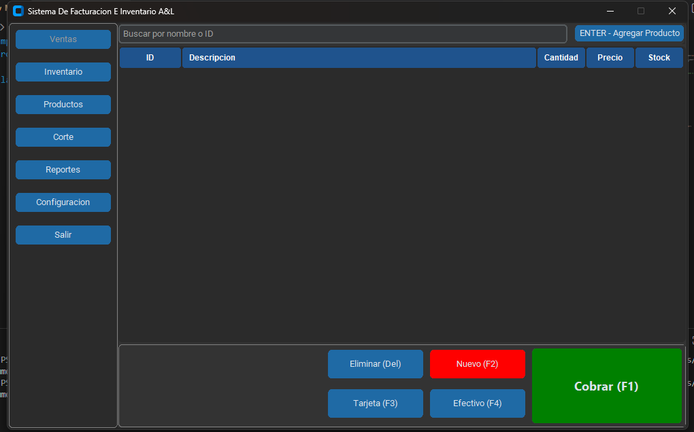

# Sistema de Facturación POS

Sistema de facturación **Point of Sale (POS)** desarrollado en **Python** utilizando **CustomTkinter**.

El proyecto está diseñado con una separación clara entre **interfaz gráfica (UI)** y **lógica de negocio (core)**, lo que facilita el mantenimiento, las pruebas y la escalabilidad.

---

## Objetivo del proyecto

Desarrollar un POS de escritorio que permita:

* Gestionar ventas
* Controlar inventario y productos
* Generar reportes y cortes
* Mantener una arquitectura limpia y extensible

---


## Estructura del proyecto

```text
C:.
│   config.py            # Configuración general del sistema
│   main.py              # Punto de entrada y ventana principal
│   __init__.py
│
└───modulos              # Interfaces gráficas (UI)
    │   UI_corte.py
    │   UI_inventario.py
    │   UI_productos.py
    │   UI_reportes.py
    │   UI_ventas.py
    │   __init__.py
    │
    └───core              # Lógica de negocio (sin UI)
            corte.py
            inventario.py
            productos.py
            reportes.py
            ventas.py
            __init__.py
```

---

## Arquitectura

### main.py

* Inicializa la aplicación
* Crea la ventana principal
* Gestiona la navegación entre módulos
* No contiene lógica de negocio

---

### UI (`modulos/UI_*.py`)

Cada módulo UI representa una pantalla del sistema:

* Maneja layout, botones y eventos
* No realiza cálculos complejos
* Delegan acciones a la capa `core`

Ejemplos:

* `UI_ventas.py`: interfaz de ventas
* `UI_inventario.py`: interfaz de inventario

---

### Core (`modulos/core/`)

Contiene la lógica del sistema:

* Cálculos de totales
* Validaciones
* Reglas de negocio
* Preparado para persistencia (DB, archivos, etc.)

Esta separación permite:

* Reutilizar lógica
* Probar el sistema sin UI
* Cambiar la interfaz sin afectar el comportamiento

---

## Flujo general de la aplicación

1. Se ejecuta `main.py`
2. Se crea la ventana principal
3. El usuario navega entre módulos
4. La UI captura eventos
5. La lógica se ejecuta en `core`

---

## Requisitos

* Python 3.10 o superior
* customtkinter

Instalación:

```bash
pip install customtkinter
```

---

## Estado del proyecto

🟡 En desarrollo

Funcionalidades en progreso:

* Persistencia de datos
* Reportes avanzados
* Control de stock
* Optimización de UI

---

## Contribuciones

Las contribuciones son bienvenidas.

Consulta el archivo `CONTRIBUTING.md` para conocer las reglas y el flujo de trabajo.

---

## Licencia

Este proyecto se distribuye bajo la licencia MIT.
